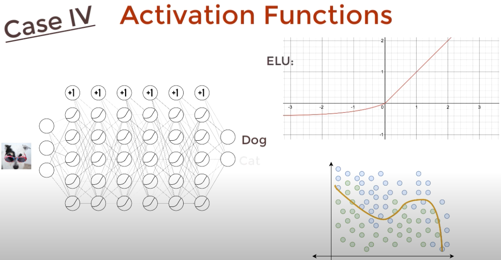

# Neural Networks and Deep Learning
Sources:
- [Neural Networks and Deep Learning](http://neuralnetworksanddeeplearning.com/)
- [Code Emporium YT](https://www.youtube.com/@CodeEmporium/videos)
- [MIT - Intro to Deep Learning](http://introtodeeplearning.com/)

### Perceptrons
A perceptron is a type of artifical neural network develop in the 1950s and 60s by scientist Frank Rosenblatt.

A perceptron takes several binary inputs, x1, x2, x3, and produces a single binary output:


In order to compute the output, we use weights, which are real numbers that tell us how important each input is. The neuron's output, 0 or 1, is determined by whether the weighted sum is less than or greater than some threshold value.

#### Bias
A perceptron can have a bias, which is a measure of how easy it is to get the perceptron to output a 1. For example, suppose we have a perceptron with two inputs, each with weight −2, and an overall bias of 3. Here's our perceptron:


### Sigmoid Neurons
Similar to perceptrons, but they are designed in way that a small change in their weights or bias will only cause a small change in their output. This is important because it allows us to use gradient descent to learn the weights and biases.

Sigmoid neurons look the same as perceptrons, but instead of outputting 0 or 1, they output a decimal value between 0 and 1, for example 0.730.


### The Architecture of Neural Networks
The leftmost layer in the network is called the input layer, and the rightmost layer is called the output layer. The middle layers are called hidden layers, because they are not directly exposed to the input or output.


Feedforward networks: A network where the output from one layer is used as input to the next layer. Information is always feed forward, never fed back. Feedforward networks don't allow feedback loops(Hidden layer 2 to hidden layer 1).
Input layer --> Hidden layer --> Output layer

Recurrent neural networks: RNNs allowed feedback loops. The idea in these models is to have neurons which fire for some limited duration of time, before becoming dormant. Loops don't cause problems in such a model, since a neuron's output only affects its input at some later time, not instantaneously.

#### Gradient Descent
A gradient descent is an iterative optimization algorithm used to minimize a function by moving in the direction of the steepest descent as defined by the negative of the gradient. Gradient descent is used to adjust the weights and biases to minimize the cost function.


Cost Function(loss function): A function that measures how far off our predictions we are from the actual target values.

Gradient descent algorithm in tensorflow:

lr = learning rate

#### Backpropagation
Backpropagation is a fast algorithm for computing the gradient of the cost function, also called the error, or the loss(How far the output was from the target). Backpropagation is short for, "backward propagation of errors".


    
Process:
- Input a training data into the input layer.
- The hidden layers receive training data and compute weights.
- The output layer computes the output.
- Compare the output with the target value to compute the error or also called the loss.
- Backpropagate the error to last hidden layer, calculate how much each neuron in the last hidden layer contributed to the error and then update its weights. And then move to the previous hidden layer, and so on.
        
Weight Adjustment: The weights are adjusted slightly in the direction that reduces the error. This adjustment is controlled by a parameter called the learning rate, which determines how big the steps are.

#### Activation Function
Activation functions transform the weights of inputs of a neuron into an output signal, introducing non-linearity(Sigmoid, ReLU) that allows neural networks to learn complex patterns.


#### Cross-Entropy Cost Function
Measures the difference between predicted and actual target(cost/loss/error). It is used in classification problems where the output is a probability value between 0 and 1.

Cross-entropy in the training process:
- Forward Pass: Model makes predictions.
- Loss Calculation: Cross-entropy loss is computed.
- Backpropagation: Gradients are calculated based on this loss.
- Optimization: Weights are updated to minimize the loss.

Models trained with cross-entropy as the cost function tend to learn faster specially when the model is wrong(early stages), because cross-entropy avoids something called, learning slowdown.

#### Learning Slowdown
Learning slowdown is a phenomenon where the model learns very slowly because the gradient of the cost function is very small when the model is wrong. Cross-entropy avoids learning slowdown by providing a significant gradient even when predictions are far off, unlike mean squared error which can produce very small gradients for highly incorrect outputs, thus ensuring consistent and effective weight updates throughout training.

#### Learning Rate
The learning rate is a hyperparameter that controls how much the weights are being adjusted in the neural network with respect to the loss gradient. The lower the value, the slower we travel along the downward slope(the slower we get to 0 loss in our model). A typical range for the learning rate is between 0.0001 and 1.0.

#### Overfitting
Overfitting is a problem in deep learning where a model learns the training data too well, including its noise and peculiarities, to the point where it negatively impacts the model ability to generalize to new data.

To detect overfitting:
Monitor training and validation loss. If training loss continues to decrease while validation loss starts to increase, its a sign of overfitting.

#### Validation Loss
Validation loss is a measure of the model's performance on a separate dataset (validation set) that was not used during training.

#### Regularization
A set of techniques used to prevent overfitting in neural networks by adding a penalty term to the loss function.

L2 Regularization(weight decay): Adds a penalty term to the loss function based on the squared values of the model's weights, encouraging smaller weights and helping prevent overfitting.

```
New Loss = Original Loss + λ(Lambda) * (sum of squared weights)
```
λ is a hyperparameter that controls the strength of the regularization effect on the model. When λ = 0, there is no regularization effect. As λ increases, the regularization effect becomes stronger.


#### Universal Approximation Theorem(Universality Theorem)
The Universal Approximation Theorem states that a neural network with a single hidden layer can approximate any continuous function to any desired degree of accuracy.

This result holds even if the function has many inputs, and many outputs. For instance, here is a network computing a function with 3 inputs and 2 outputs:

 
#### The Vanishing Gradient Problem
The vanishing gradient problem occurs when the gradients of the loss function approach zero as they are backpropagated through the network during training. This can cause the first layers to learn slowly, or not at all, resulting in poor performance overall in the network. This is caused by the activation functions used in the network, such as the sigmoid function, which can squash the output of the neurons to a very small range(e.g., 0 to 1 for sigmoid), causing the gradients to become very small. This can be mitigated by using activation functions that do not squash the output as much, such as the ReLU activation function.

### Convolutional Neural Networks(CNNs)
A feed-forward neural networks that is generally used for computer vision tasks.

Tasks in computer vision:
- Regression: Predicting a continuous value.
- Classification: Predicting a category.

CNNs are divided into 2 main parts:
- Feature learning: Extracting features using convolutional and pooling layers.
- Neural network architecture: Making predictions using fully connected layers. The architecture depends of which task we are trying to solve.
    - Classication: Outputs a single value(Yes or No)
    - Object detection: Outputs what objects are in the image and where they are.
    - Segmentation: Outputs the input image with each pixel labeled with the object it belongs to.
    - Probabilistic control: Outputs probability distributions over possible actions or control decisions, rather than deterministic values. E.g., self-driving cars.


CNN in classification task


Feature extraction with convolution


Filters: Two-dimensional arrays of numbers. They are used to extract features from the input data.

#### Convolution
Multiplying the filter with a small window of the input data, then summing the results to produce a single output.


#### Local Receptive Field
Instead of connecting each input neuron to every neuron in the hidden layer, each hidden neuron is connected to only a small window of the input neurons.


Stride: The number of pixels by which the window moves after each operation. In the example below, the stride is 1, meaning the window moves one pixel at a time.


#### Features
A specific pattern or characteristic in the input data that the network is trying to learn.


#### Feature Maps
Feature maps are the outputs of a convolutional layer in a CNN. They help the network find important features anywhere in the input.


#### Shared Weights and Biases
In a traditional neural network, each neuron has its own set of weights and biases. In a CNN, neurons in the same feature map share the same weights and biases.

- Shared weights: Weights defining the feature map.
- Shared biases: Biases defining the feature map.
- Kernel or filter: Defined by the shared weights and shared biases.

#### Pooling Layers
Used after convolutional layers to reduce feature map size, improving efficiency and reducing overfitting.

Max Pooling: Max pooling is the most commonly used pooling operation in CNNs. Selects the highest value in each small region of the feature map, preserving important features while reducing dimensions.


### Recurrent Neural Networks(RNNs)
Neural networks that hold a state that is updated at each time step, as a sequence of data is processed. This allows RNNs to capture relationships between elements in the sequence.

Formula to apply recurrence relation at every time step:
```
cell state = function wt weights(input, old state)
```
or
```
h = f(x, h-1)
```

Adding recurrence to neurons by adding variable h, which holds the state of the neuron.


#### Sequence modeling
A key application of RNNs that enables the processing and analysis of sequences of data by capturing relationships between elements in the sequence.


#### Encoding language for a Neural Network
Neural networks cannot interpret words("deep", "learning"), but they can interpret numbers([0.1, 0.8, 0.6]).

Embedding: A technique used to convert words into numerical vectors([0.1, 0.8, 0.6]) that can be understood by neural networks.

#### Long Short-Term Memory(LSTM)
A type of RNN that is capable of learning long-term dependencies in data. It does this by maintaining a cell state that can be updated, added to, or removed, allowing it to remember or forget information over long periods of time.

Gated cell: A cell in an LSTM that controls the flow of information in and out of the cell state.

#### Self-Attention
A mechanism that attends(focus) to the most important parts of an input sequence.

Positional encoding: A technique used to encode the position of each element in the input sequence, allowing the self-attention mechanism to consider the order of the elements.

Self-Attention steps:
- Encode positional information, outputs a positional embedding.
- Extract query, key, and value from positional embedding.
    - Query: The question being asked.
    - Key: The potential answer identifier.
    - Value: The actual answer content.
- Compute attention weighting, by comparing similarity between query and key.
    - Attention formula:
    
    - Softmax function: Converts the attention scores into probabilities(o to 1).
- Extract features with high attention.


Multi-Head Attention: Each head is their own attention mechanism, allowing the model to focus on different parts of the input sequence.

